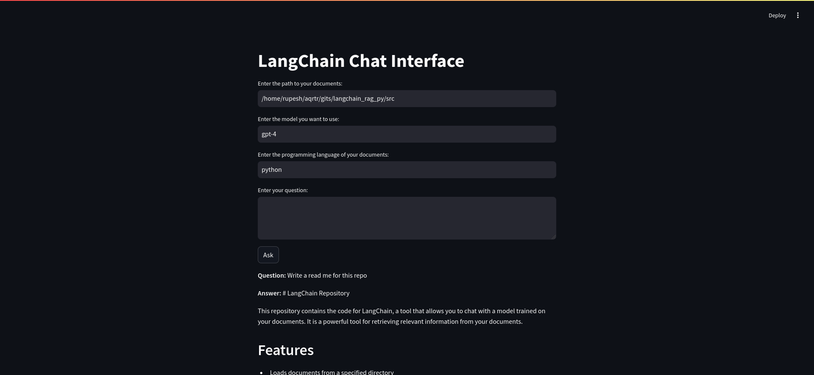

# Chat with your Codebase using LangChain and OpenAI's GPT-4 
This read me is generated using LangChain and OpenAI's GPT-4 model.

```bash
Enter the path to your documents: /home/rupesh/gits/langchain_rag_py/src
Enter the model you want to use [gpt-4]: 
Enter the programming language of your documents [go]: python
Enter your question (or type 'exit' to quit): write a readme for this repo

```
## Streamlit UI
```bash
streamlit run main.py
```


LangChain is a powerful tool that uses advanced language models to process, analyze, and generate insights from your documents. It combines the power of the OpenAI's GPT-4 model for natural language processing, making it possible to embed and analyze your documents in a more meaningful way.

## Features

- **Document Loading**: LangChain can load documents from a specified directory using the DirectoryLoader.
- **Document Splitting**: It can split the loaded documents into chunks using the RecursiveCharacterTextSplitter.
- **Embedding**: The chunks are then embedded and added to the Chroma database.
- **UI Interface**: A Streamlit UI titled "LangChain Chat Interface" is available for easier interaction with the system.
- **Flexible Document Support**: LangChain supports various document types including JavaScript, TypeScript, Go, Python, Java, C, C++, Ruby, PHP, HTML, etc. It excludes specific files like Dockerfiles, README, etc.
- **Question Answering**: An interactive chat feature is available for asking questions about your documents.

## How to Use

1. Load your documents from the specified directory.
2. The documents are then split into manageable chunks.
3. These chunks are embedded and added to the Chroma database.
4. Start the Docker Compose for the Chroma database.
5. Use the Streamlit UI for interaction. 
6. Input the path to your documents, the model you want to use, and the programming language of your documents in the Streamlit UI.
7. Ask questions about your documents in the chat interface.

## Dependency 

This repository is dependent on the OpenAIEmbeddings and Streamlit for the UI interface.

## Contribution

Contributions are welcomed. Please fork this repository and create a new pull request.

## License

This project is licensed under the terms of the MIT license. 

**Note:** This project is part of the LangChain community's efforts to leverage AI for better document analysis. For more information, please visit our website.